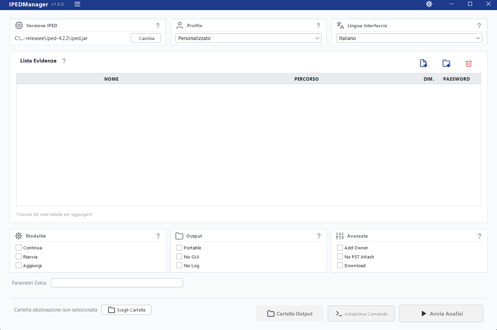
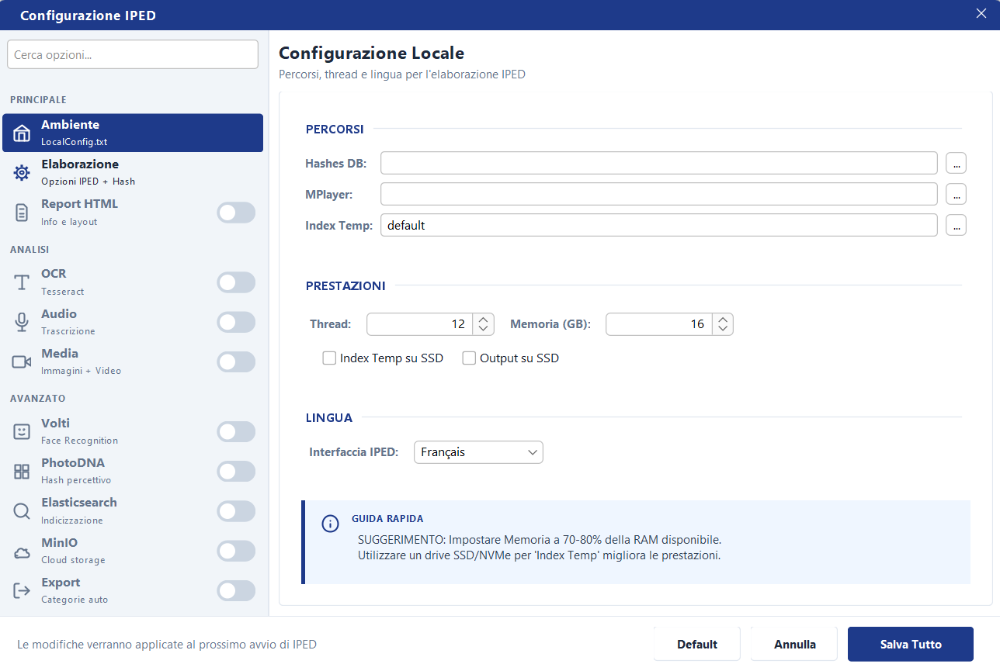
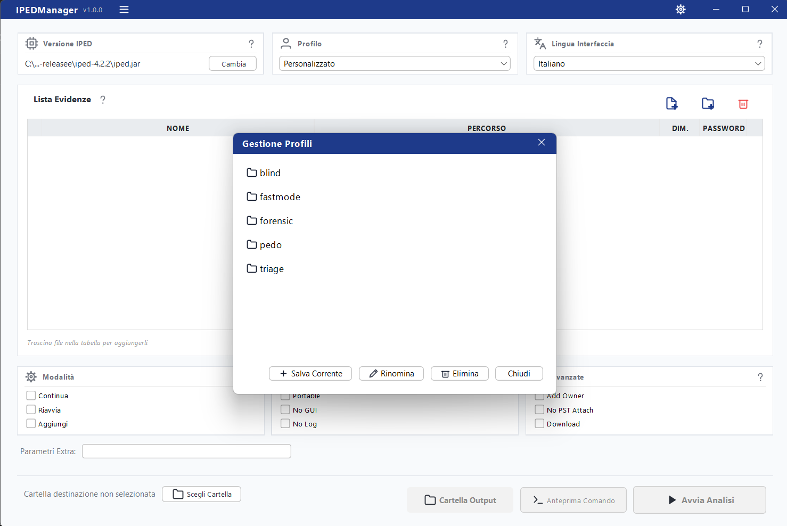

**IPEDManager** is a modern, user-friendly graphical interface for [IPED (Digital Evidence Processor and Indexer)](https://github.com/sepinf-inc/IPED). It simplifies the configuration and execution of forensic analysis tasks, offering a professional dashboard with advanced profile management, real-time monitoring, and comprehensive configuration options.


## 🚀 Key Features

*   **Modern UI**: Built with Java Swing and FlatLaf for a clean, dark-themed (or light-themed) professional aesthetic.
*   **Profile Management**: Save, load, rename, and delete custom processing profiles easily.
*   **Configuration Manager**: A complete GUI to configure all IPED modules (Hashing, OCR, Audio, Video, Export, etc.) without editing text files manually.
*   **Real-time Monitoring**: Watch the execution progress with a built-in terminal-like monitor and progress bar.
*   **Drag & Drop**: Easily add evidence files and folders by dragging them into the evidence table.
*   **Multilingual Support**: Fully localized in English, Italian, Spanish, and Portuguese.
*   **Portable Report Generation**: Option to generate portable execution reports.

## 🛠️ Prerequisites

*   **Java Runtime Environment (JRE)**: Version 8 or higher (IPED typically bundles its own or requires a specific version).
*   **IPED**: You need to have IPED installed. IPEDManager acts as a frontend for it.

## 📦 Installation

1.  Download the latest release from the [Releases](https://github.com/Trita-a/IPEDManager/releases) page.
2.  Extract the archive.
3.  Run `IPEDManager.exe` (Windows).
4.  On first run, point IPEDManager to your `iped.jar` file.

## 🔨 Building from Source

To build IPEDManager from source, you need:

*   **Python 3.x**: For the build script.
*   **Java JDK**: To compile the Java code (ECJ is used in the script, ensure paths are correct).
*   **Launch4j**: To create the Windows executable.

### Build Steps

1.  Clone the repository:
    ```bash
    git clone https://github.com/yourusername/IPEDManager.git
    ```
2.  Configure paths in `build.py` if necessary (e.g., path to JDK, Launch4j).
3.  Run the build script:
    ```bash
    python build.py
    ```
4.  The compiled artifacts will be in the `IPED-release/` directory.

## 🧩 Project Structure

*   `src/`: Source code (Java).
*   `resources/`: Icons, properties files, and other assets.
*   `lib/`: External dependencies (FlatLaf, etc.).
*   `build.py`: Python script for automated building and deployment.

## 📄 License

This project is licensed under the MIT License - see the [LICENSE](LICENSE) file for details.

## 👨‍💻 Author

**William Tritapepe**

---
*Note: This tool is not affiliated with the official IPED project but serves as a community-developed enhancement.*

## 📸 Gallery

<p align="center">
  
  <br>
  <em>Main Dashboard - clean and intuitive interface</em>
</p>

<p align="center">
  
  <br>
  <em>Advanced Configuration - easy-to-use toggles and settings</em>
</p>

<p align="center">
  
  <br>
  <em>Profile Manager - save and load your analysis presets</em>
</p>
